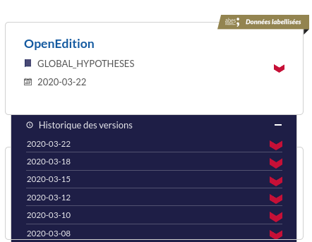

BACON
-----------

`BACON <http://bacon.abes.fr>`_ (*BAse de COnnaissance Nationale*) is a platform
created and maintained by the `ABES <http://abes.fr/>`_ (*Agence Bibliographique pour l'Enseignement Supérieur*)
in order to provide a Knowledge Base hub, centralizing KBART storage & access
from many providers relevant for Superior Education & Research.

BACON provides free metadata (everything is `CC0-licensed <https://creativecommons.org/publicdomain/zero/1.0/deed.fr>`_)
for signaling electronic resources. It offers various services related to
knwoledge bases.

A National Knowledge Base
^^^^^^^^^^^^^^^^^^^^^^^^^^^^^^^^^^^^^^^^^^^^^^

At the end of March 2020, BACON gathers data from 106 providers, making more
than 850 packages available from https://bacon.abes.fr

This website offers three main functionnalities : exporting data, signaling
mistakes & syndication feeds. It comes with a `documentation available in English <http://documentation.abes.fr/aidebacon/EN/index.html>`_,
and a `useful glossary <https://bacon.abes.fr/glossaire.html>`_, yet only in
French. (alternatively, one can consult `NISO Kbart glossary <https://www.niso.org/standards-committees/kbart/kbart-glossary-relevant-terms>`_)

This documentation also describes a few webservices, which allow one to build
complex tools over BACON. These webservices expose KBART, XML or JSON and offer
various functionnalities, such as retrieving a structured list of available
packages.

The BACON documentation being quite extensive, we won't be detailing here how to 
use BACON website & webservices.

Standard name scheme & unique endpoint
^^^^^^^^^^^^^^^^^^^^^^^^^^^^^^^^^^^^^^^^^^^^

BACON-hosted KBART files follow the KBART recommandation for file naming:
``[ProviderName]_[Region/Consortium]_[PackageName]_[YYYY-MM-DD].txt``

Knowing a KBART file name, it is possible to access it at:
``https://bacon.abes.fr/package2kbart/[Filename]``

.. _versions:

Versionning
^^^^^^^^^^^^^^

As the name scheme above suggests, BACON makes it possible to get the version
of a KBART file at a given date by specifying it in the last part of the file
name, in ``YYYY-MM-DD`` format.

If that part is omitted, so the filename looks like ``[ProviderName]_[Region/Consortium]_[PackageName].txt``,
BACON will automatically serve the most up-to-date version.

It is also possible to graphically browse a file's versions in the website
interface:

Data curation & quality label
^^^^^^^^^^^^^^^^^^^^^^^^^^^^^^^^^^^

BACON's data is monitored and curated by the ABES teams. When a KBART file meets
`certain quality criterias <https://punktokomo.abes.fr/2015/05/28/bacon-et-la-labellisation-des-donnees-a-quelle-aune-mesure-t-on-la-qualite-dun-fichier-kbart/>`_,
it is given a "quality label". As it can be seen in the above screenshot, the
OpenEdition Hypotheses KBART has been highlighted by this label.

.. warning::
   
   KBART files served by BACON are appended a non-standard 26th column, called
   ``bestppn``. It is the best matching identifier found for this resource in
   the `SUDOC catalogue <http://sudoc.abes.fr>`_. Additional information about
   this 26th column can be found in `this article from the ABES's blog <https://punktokomo.abes.fr/2020/03/23/chantier-bacon-partie-1-liage-du-sudoc-et-de-bacon-par-les-ppn/>`_. 
   
   Most of the time, it can simply be ignored if it's not of any use to you.
