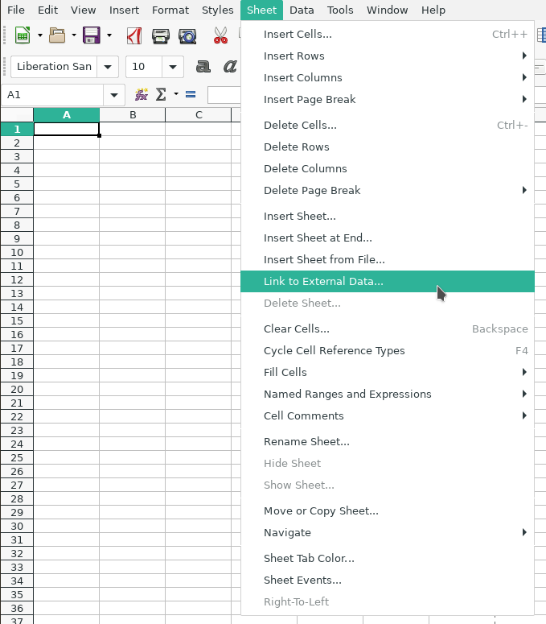
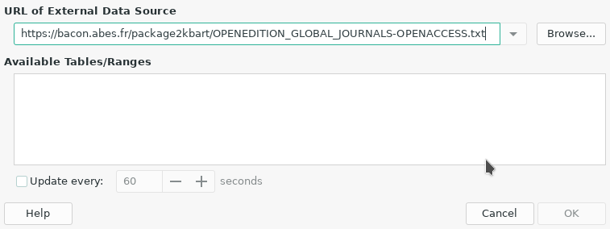
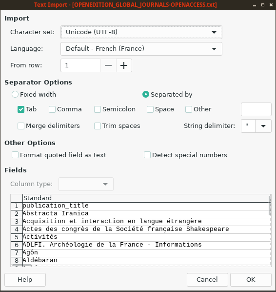
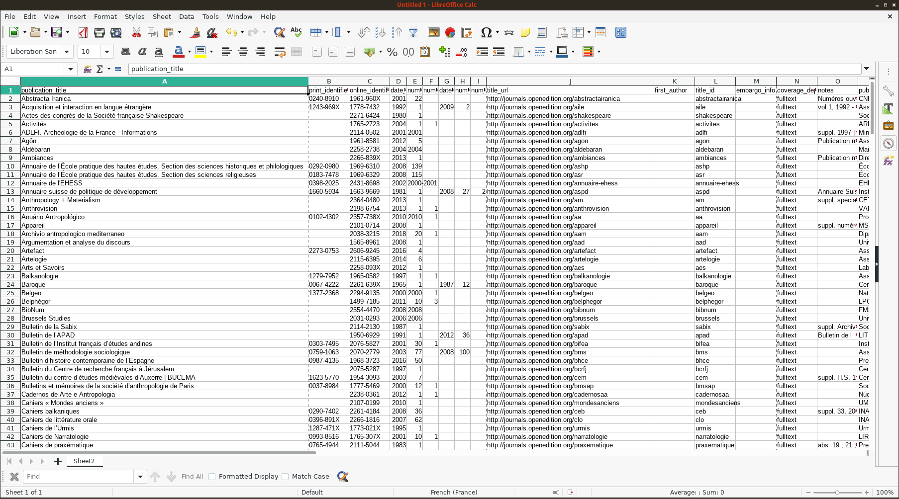
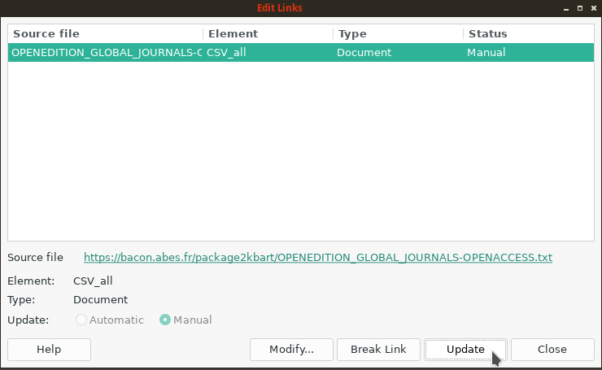

.. libreoffice:

Working with KBART files in LibreOffice 
============================================
   
We provide here a simple example of how to perform data extraction from BACON
with `LibreOffice <https://libreoffice.org>`_ (a free and open source office
suite, created and maintained by `The Document Foundation <https://www.documentfoundation.org/>`_).
We'll show how to automatically retrieve coverage data for Open Access Journals
from OpenEdition Journals.

First, create a new LibreOffice Calc spreadsheet. Once this is done, in the menu
bar, select "Sheet", and then `"Link to External Data..." <https://help.libreoffice.org/Calc/Inserting_External_Data_in_Table_WebQuery>`_
in the dropdown menu.

In the opening window, fill the URL with the desired KBART package. You'll find
all the availables KBART packages in the :ref:`access section of this documentation <access>`.

Be careful to add the extension ".txt" at the end of the URL, otherwise
LibreOffice won't load the data. Press enter.

A new window should open, asking for importation settings. Tabulation should be
selected as the separator:

Validate importation and external data dialogs. The data should have been
imported in your spreadsheet:

Now let's rename this sheet as "BACON" and switch to another sheet. From this
one, which won't be affected when we update the data, we can perform usual
operations with Libreoffice: filtering, using formulas & macros, etc.

For example, in order to search for a given journal by its e-ISSN and return its
first available issue, we can enter this formula in the A1 cell:

``=CONCAT(VLOOKUP(B1;$BACON.C:E;2;0);"-";VLOOKUP(B1;$BACON.C:E;3;0))``

The searched ISSN has to be entered in cell B1. With a little practice, powerful
tools can be built this way, in order to monitor publications or track newly
available issues. The extensive `Libreoffice documentation <https://documentation.libreoffice.org/>`_
may be of some help.

When needed, the data might be updated by using the "Links to external files"
in the "Edit" menu:

